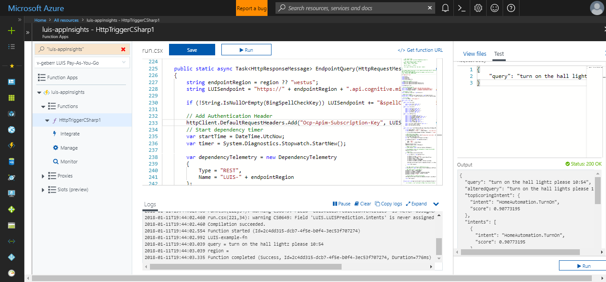
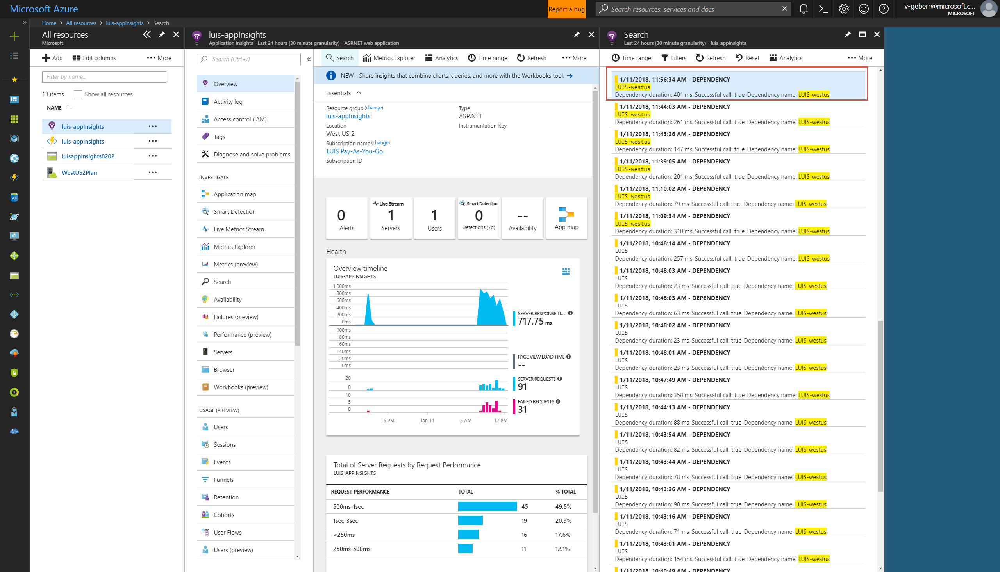
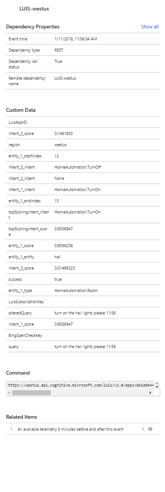

# Azure Function

This example wraps the [LUIS](https://docs.microsoft.com/azure/cognitive-services/LUIS/) endpoint query in an [Azure Function](https://azure.microsoft.com/services/functions/). The LUIS HTTP request is treated as a dependency of the Azure Function when logged in Application Insights. 

The bot/client app HTTP calls into the [C# HttpTrigger](https://docs.microsoft.com/en-us/azure/azure-functions/functions-create-first-azure-function) function. 

## Azure Functions
[Azure functions](https://azure.microsoft.com/en-us/services/functions/) allow you to quickly get an HTTP endpoint without dealing with the configuration or management of an Internet server. 

Instead of making an HTTP call to the LUIS endpoint, you will make an HTTP call to the Azure function. You pass the LUIS utterance either in the HTTP GET query string or in the HTTP POST body to the Azure function.  

The Azure function gets the LUIS utterance, as "query", then passes it along to the LUIS endpoint. The Azure function gets the LUIS response, inserts the response into [Application Insights](https://azure.microsoft.com/services/application-insights/), then returns the LUIS response back to the bot or client app exactly as if it was from LUIS -- whether it is a successful or erroring request. 

When you create your C# Azure webhook function, make sure to check the ApplicationInsights box. It is helpful if the LUIS app, Azure function, and ApplicationInsights service are in the same region. This example was written and tested for the West US 2 region.

The Azure function receives the LUIS query and LUIS region (optional) either in the query string or the body of a POST. 

## Steps to use this example
The order of these steps is important so that the NuGet packages are successfully installed.

1. Upload [package.json](package.json) file in the Azure Function portal. This adds the NuGet packages. Wait until the packages are installed before continuing.
2. Alter run.csx in Azure Function portal to match this [run.csx](run.csx).
3. Change the variables for your Subscriptions and App:
    
    |variable name|purpose|
    |--|--|
    |LUISappID|LUIS app ID|
    |LUISsubscriptionKey|LUIS subscription Key|
    |BingSpellCheckKey|Bing Spell Check Key (optional)|

4. Save and Test with an utterance from your app. 
    

5. Open ApplicationInsights in the portal and search for "LUIS-" or "LUIS-" and the region such as "LUIS-westus". It may take a few minutes for the Azure Function request to show up in Application Insights. 

    

    The ApplicationInsights entries for the Azure Function will contain HTTP request information as well as LUIS-specific information. 

    

    Select the top item. View the details including HTTP information and LUIS information. 

    

## Next Steps
[Get started](https://docs.microsoft.com/azure/application-insights/app-insights-analytics) with about Application Insights.
 
[Learn about securing the Azure function app with authentication and authorization](https://docs.microsoft.com/azure/app-service/app-service-authentication-overview)

